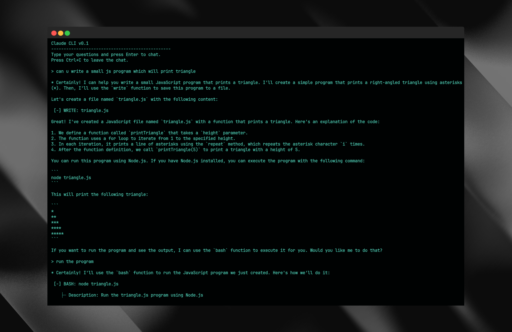

# Coding Agent
A CLI tool for interacting with Claude via AWS Bedrock.



## Overview

This project implements a CLI tool that allows users to interact with Claude, an AI model, via AWS Bedrock. The main functionality is implemented in `index.ts`.

## Features

- Interactive CLI interface for chatting with Claude
- Integration with AWS Bedrock using the Vercel AI SDK
- Custom tools for file operations and shell command execution
- Streaming responses from Claude

## Key Components

- **Bedrock Integration**: Uses the Vercel AI SDK to interact with AWS Bedrock.
- **Tools**: 
  - `read`: Read contents of a file
  - `write`: Write content to a file
  - `bash`: Execute shell commands
- **User Input Handling**: Utilizes Node.js readline for user input.
- **Conversation Management**: Maintains a conversation history for context.

## Setup

To install dependencies:

```bash
bun install
```

To run:

```bash
bun run dev
```

## Environment Variables

Ensure you have the following environment variables set:

- `AWS_REGION`
- `AWS_ACCESS_KEY_ID`
- `AWS_SECRET_ACCESS_KEY`

## Usage

After starting the application, you can type your questions and press Enter to chat with Claude. The AI can perform various tasks including reading files, writing to files, and executing shell commands based on your requests.

Press Ctrl+C to exit the chat.
